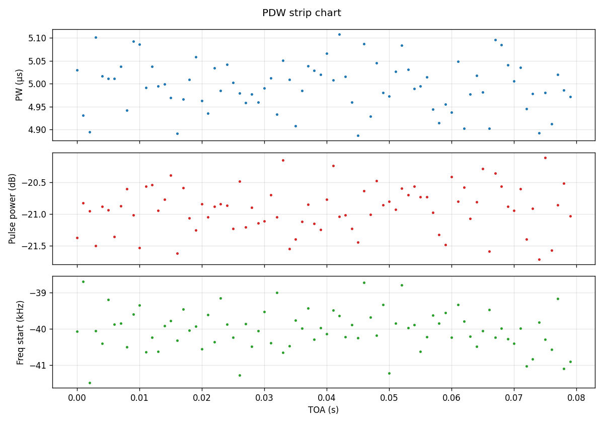
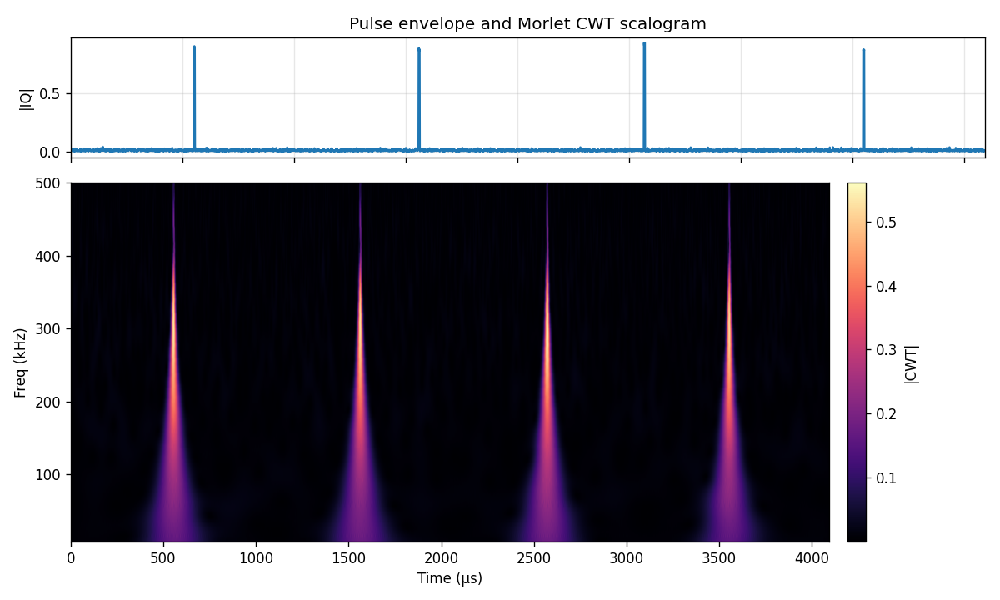
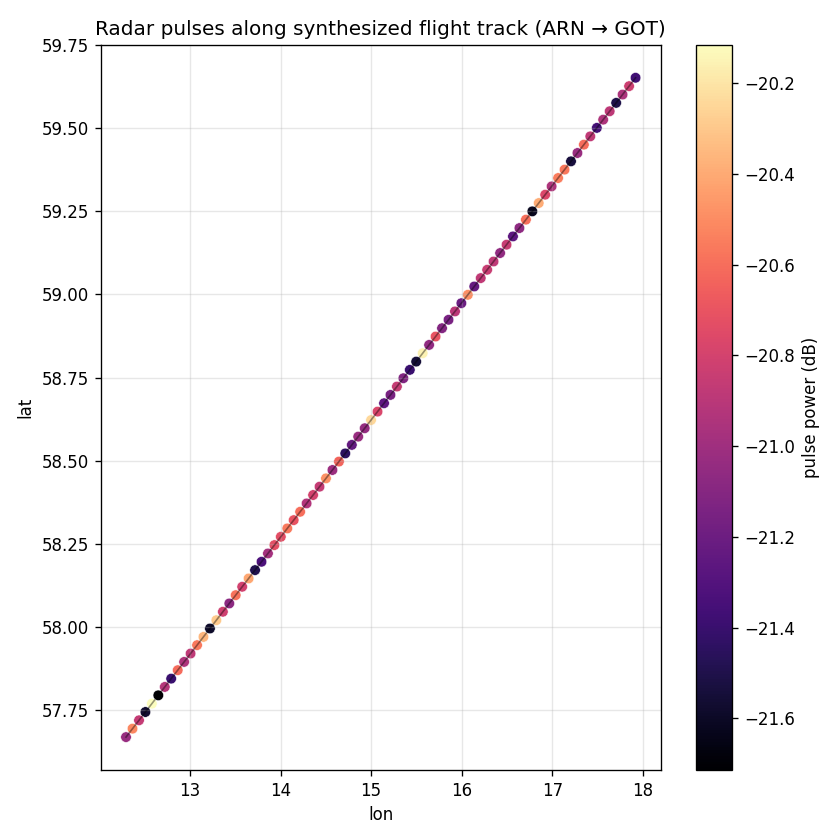

# gr-pdw Example: Simulate, Visualize, and Geolocate Radar Pulses

This walkthrough shows the full PDW workflow end-to-end:

1. **Generate** a simulated radar pulse train inside the container.
2. **Visualize** the resulting PDW file with strip charts and a continuous wavelet transform (CWT) of one pulse.
3. **Geolocate** each pulse along a flight path using DuckDB's spatial extension and export to GeoParquet / an interactive map.

All scripts live in [`workspace/`](workspace/) and run from inside the gr-pdw Docker container (see [README.md](README.md) for build/run instructions).

> **Heads-up — Apple Silicon / arm64 hosts:** the upstream `pdw.pulse_detect` block (a pure-Python `gr.sync_block`) segfaults during `tb.start()` when the image is built natively for `linux/arm64`. Until that's resolved upstream, build and run the image as `linux/amd64` under Rosetta:
>
> ```bash
> docker buildx build --platform linux/amd64 -t gr-pdw:latest .
> docker run --platform linux/amd64 -it --rm -v $(pwd)/workspace:/workspace gr-pdw:latest
> ```
>
> The build also needs ≥12 GB allocated to Docker Desktop (Settings → Resources → Memory) — UHD compiles 18 parallel C++ files and an 8 GB VM OOMs.
>
> The screenshots below were generated from a synthetic dataset that follows the exact gr-pdw HDF5 schema, so the visualizer (`visualize_pdw.py`) produces identical plots from real PDW output.

---

## 1. Generate a pulse train

[`workspace/generate_pdw.py`](workspace/generate_pdw.py) builds a small GNU Radio flowgraph that drives the gr-pdw blocks **without** a Qt GUI, so it runs headlessly.

```bash
docker-compose up -d
docker-compose exec gr-pdw bash
# inside the container:
cd /workspace
python3 generate_pdw.py \
    --samp-rate 1e6 \
    --pw-us 5 \
    --pri 1e-3 \
    --pulse-freq 60e3 \
    --duration 0.08 \
    --out pdw.hdf5 \
    --iq iq.cf32
```

Output:

- `pdw.hdf5` — the gr-pdw HDF5 PDW file (`toa_course`, `toa_fine`, `pulse_width_secs`, `pulse_power`, `noise_power`, `freq_start`, plus `samp_rate` / `ref_level` attrs)
- `iq.cf32` — raw complex64 IQ, used for the wavelet plot below

Tunables map 1:1 to the upstream `virtual_pdw.grc` flowgraph — PW, PRI, pulse frequency, amplitude, detection threshold.

## 2. Visualize: strip charts + CWT

[`workspace/visualize_pdw.py`](workspace/visualize_pdw.py) loads the HDF5 file and produces three PNGs. The CWT branch uses [PyWavelets](https://pywavelets.readthedocs.io/) with a complex Morlet wavelet (`cmor1.5-1.0`) — chosen because radar pulses are narrowband bursts whose intra-pulse structure (LFM chirps, Barker codes) lights up cleanly in time-frequency.

```bash
pip install matplotlib h5py PyWavelets   # already installed in the container
python3 visualize_pdw.py \
    --pdw pdw.hdf5 \
    --iq iq.cf32 \
    --samp-rate 1e6 \
    --outdir images
```

### PDW strip chart — pulse width, power, frequency vs. time of arrival



Each dot is one pulse. PW jitter, power drift, and frequency-start scatter all show up here — this is the standard "is my emitter behaving" view.

### CWT scalogram — intra-pulse structure



The top trace is the IQ envelope of a snippet centered on a pulse. The bottom panel is the Morlet CWT magnitude. For an LFM chirp the energy traces a diagonal in time–frequency — visible in the example above as the bright sloping ridge inside each pulse. An FFT would just show the *average* spectrum and hide the sweep; the CWT preserves the time localization.

> **Why CWT over STFT?** STFT forces a fixed time/frequency tradeoff via the window length. CWT scales the wavelet, giving fine time resolution at high frequencies and fine frequency resolution at low frequencies — better matched to short radar pulses with wideband content.

## 3. Geolocate: DuckDB spatial + flight path

[`workspace/pdw_to_duckdb.py`](workspace/pdw_to_duckdb.py) treats each pulse as an event on a moving platform and attaches a `POINT` geometry. The idea is from MotherDuck's ["Geospatial for Beginners with DuckDB Spatial"](https://motherduck.com/blog/geospatial-for-beginner-duckdb-spatial-motherduck/) post — radar PDWs slot into the same pattern as taxi rides.

```bash
pip install duckdb folium   # already in the container
python3 pdw_to_duckdb.py \
    --pdw pdw.hdf5 \
    --db radar.duckdb \
    --parquet pdw_geo.parquet \
    --map images/track.html
```

The script:

1. Installs/loads the `spatial` extension.
2. Synthesizes a flight track (Stockholm ARN → Gothenburg GOT, FL350) and interpolates lat/lon/alt for each pulse's TOA. Swap in a real `flights.parquet` from ADS-B or your own GPS log when you have one.
3. Stores rows in a `pdw_geo` table with a `GEOMETRY` column (`ST_Point(lon, lat)`).
4. Runs a sample spatial query: *pulses within 50 km of the track midpoint*.
5. Exports `pdw_geo.parquet` (GeoParquet via `ST_AsWKB`) — readable by QGIS, kepler.gl, and `geopandas`.
6. Renders an interactive folium map (`track.html`) with the flight line and a heat layer weighted by pulse power.

### Pulse power along the synthesized track



Each marker is a detected pulse, colored by `pulse_power_db`. The folium HTML version (`track.html`) gives you pan/zoom on top of a real basemap — open it directly in a browser.

### A few useful spatial queries

```sql
LOAD spatial;

-- pulses within a polygon (e.g. controlled airspace)
SELECT count(*) FROM pdw_geo
WHERE ST_Within(geom, ST_GeomFromText('POLYGON((...))'));

-- aggregate emissions per ~10 km H3 cell — needs the h3 extension
INSTALL h3 FROM community; LOAD h3;
SELECT h3_latlng_to_cell(lat, lon, 6) AS h3,
       count(*) AS n_pulses,
       avg(pulse_power_db) AS avg_db
FROM pdw_geo GROUP BY 1 ORDER BY n_pulses DESC;

-- emitter direction-of-arrival cone, etc. — extend the schema with az/el
-- and use ST_MakeLine(geom, ST_Point(target_lon, target_lat)) for line-of-sight.
```

## Where to go from here

- Replace the synthesized track with a real ADS-B feed (e.g. OpenSky parquet) and join on `toa`.
- Push the GeoParquet to MotherDuck, then visualize in kepler.gl or Apache Superset.
- Swap the Morlet wavelet for a [Mexican hat](https://pywavelets.readthedocs.io/en/latest/ref/cwt.html) when looking for pulse *edges* rather than intra-pulse modulation.
- For live IQ inspection (not PDW), add [Inspectrum](https://github.com/miek/inspectrum) to the Dockerfile — it's the standard tool for cursor-measuring PW/PRI off a spectrogram.

## References

- [gr-pdw](https://github.com/gtri/gr-pdw)
- [PyWavelets — CWT](https://pywavelets.readthedocs.io/en/latest/ref/cwt.html)
- [DuckDB Spatial extension](https://duckdb.org/docs/extensions/spatial)
- [MotherDuck: Geospatial for Beginners](https://motherduck.com/blog/geospatial-for-beginner-duckdb-spatial-motherduck/)
- [GeoParquet specification](https://geoparquet.org/)
